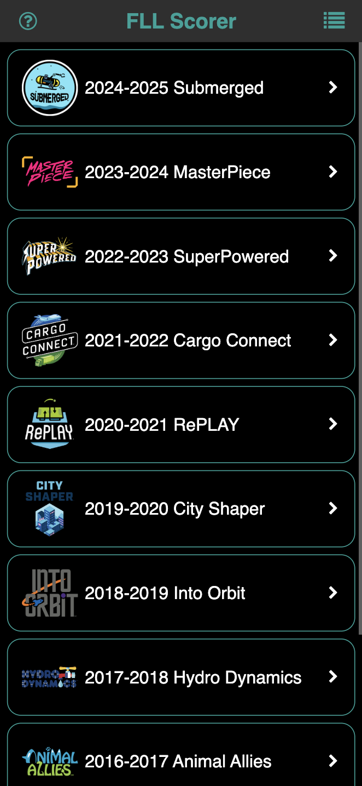
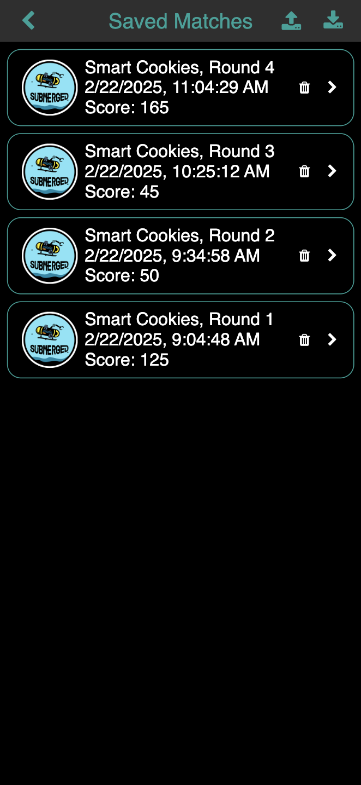

Copyright &copy; 2025 Brian Kircher

Open Source Software; you can modify and/or share it under the terms of BSD
license file in the root directory of this project.

# Overview

This project is a scoring application for the robot game of FIRST LEGO League
(FLL). It is targeted at mobile devices, and is intended to be installed as a
progressive web app (PWA).

At startup, a list of FLL seasons that can be scored are shown:

  

The list can be scrolled up and down to uncover all of the games that are
supported. Clicking on one enters the scoresheet for that game:

  

Scoring is performed by making selections for each mission in the game. The
score is updated whenver a selection is made or changed, and the current score
is always visible in the lower left of the screen. If selections are made that
are not valid (for example, a game piece is marked as being delivered somewhere
but has not been marked as being retrieved from it starting location), an error
appears in red below the relevant mission. In some cases, it is possible to
achieve un-obtainable scores when the error are ignored!

The reset button in the upper right of the screen resets the state of the
scoresheet (in other words, unselecting everything). The save button in the
lower right of the screen saves the current state of the scoresheet; useful for
tracking the progress of a team throughout the season, and capturing their
performances at a competition.

On the main screen, the list button in the upper right of the screen shows the
saved scoresheets:

  

Clicking on one of them shows the saved scoresheet but does not allow it to be
changed. The import and export buttons in the upper right corner of the saved
scoresheet screen allows the saved score to be saved (in JSON format) and then
re-loaded (into the same device, or a different device if the file is
transferred, which is outside the scope of this application!).

# Caveats

The scores produced by the application are believed to be accurate. However,
this is not an official scoring application; discrepancies between the scores
that this application produces and the scores from the official scoring
software are by definition the fault of this application.

# Installation

While the application can be used from the web browser, some advantages of
installing it on your device are:

* It can be quickly run via an icon on the home screen.

* It is fully cached on your device, so it is fully functional even if there
  is no network connection (as is the case in some school buildings).

* It is easier than trying to remembering an arcane URL!

Note that using a simple link on your home screen achieves most of these,
except for being able to run without a network connection.

## iOS

After navigating to the application's site in a web browser, do the following:

* Click on the share button (may be on the bottom of the browser window for
  iPhones and the upper right of the browser window for iPads).

* Scroll down and select "Add to Home Screen" from the menu that pops up.

* Select "Add" in the upper right to install this application to the home
  screen.

To remove the application, a long press on the home screen icon will bring up
the application menu; select "Delete Bookmark" (in red) to start the process.

## Android

After navigating to the application's site in a web browser, do the following:

* Click on the three vertical dots in the upper right corner of the browser.

* Select "Add to Home screen" from the menu that pops up.

* Select "Install" to install this application (as opposed to adding a browser
  shortcut).

* Select "Install" to confirm that you'd like to install the application.

* Select "Add to Home screen" to finalize installing the application to the
  home screen.

To remove the application:

* Go to "Settings"

* Select "Apps"

* Select "See all apps"

* Select "FLL Scorer"

* Select "Uninstall"

# Trademarks

FIRST&reg; is a trademark of For Inspiration and Recognition of Science and
Technology (FIRST), which does not sponsor, authorize, or endorse this
application.

LEGO&reg; is a trademark of the LEGO Group of companies, which does not
sponsor, authorize, or endorse this application.

# Acknowledgements

[jQuery](https://jquery.com), [Font Awesome 4.7](https://fontawesome.com/v4),
and [BrowserStack](https://www.browserstack.com) are used by this project.

This project is tested with BrowserStack